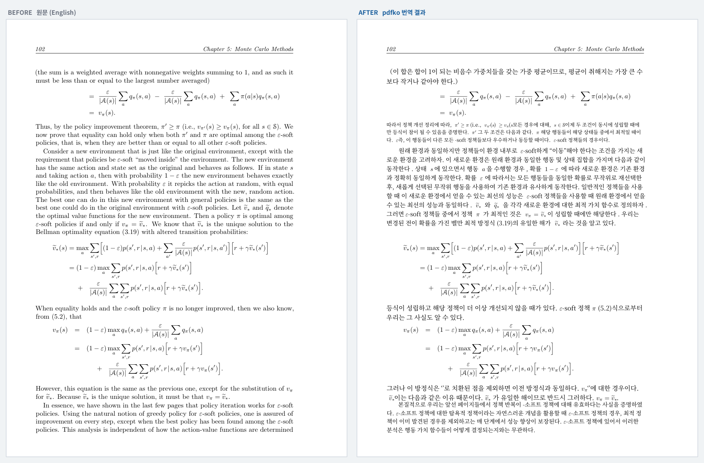
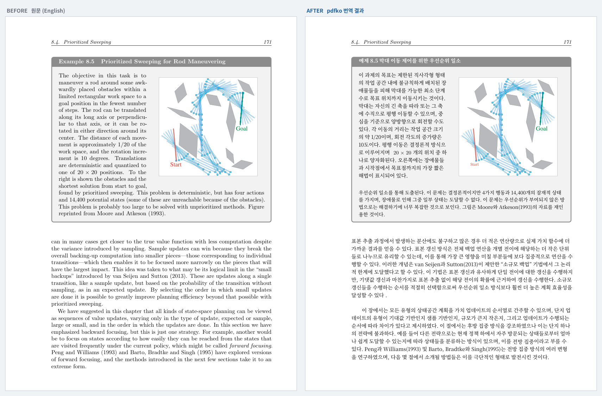
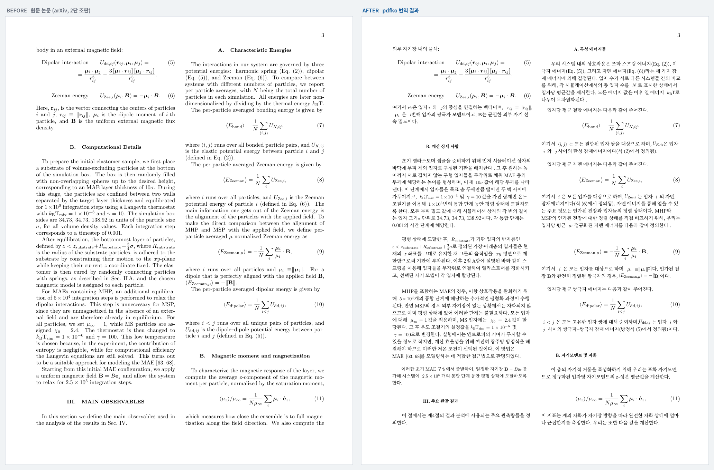

# pdfko

**영문 교재와 논문을 레이아웃 그대로 한국어로 번역합니다.**

```bash
pdfko book.pdf
```

명령 한 줄이면 됩니다. 수식·그림·표는 원본을 그대로 다시 그리므로 훼손되지 않고, 2단 조판과 쪽번호도 원본과 같습니다. 용어는 알아서 통일되고, 글자가 겹친 페이지는 스스로 찾아 되살립니다.

분야를 가리지 않습니다. 도구 안에 용어 목록이 들어 있지 않고, 문서를 직접 읽어 그 분야의 용어를 찾아냅니다.

전부 내 컴퓨터에서 돌아갑니다. API 요금이 들지 않고, 원고가 밖으로 나가지 않습니다.

## 결과물

### 교재

강화학습 교재 *Reinforcement Learning: An Introduction* (Sutton & Barto, 548쪽)을 번역한 실제 페이지입니다.

**수식이 많은 쪽** — 수식은 손대지 않고 본문만 바뀝니다



**그림과 예제 상자가 있는 쪽** — 그림, 배치, 색 상자가 그대로 유지됩니다



### 논문

교재만 되는 게 아닙니다. arXiv 물리 논문(연성물질)을 그대로 넣은 결과입니다. **2단 조판과 수식 번호가 유지됩니다.**



내 분야도 되는지 궁금하다면 — 아래는 각 논문에서 도구가 직접 찾아낸 용어입니다.

| 분야 | 찾아낸 용어 |
|---|---|
| 천체물리 | rest-frame · systemic redshift · covering factor |
| 연성물질 | volume fraction · zeeman energy · magnetoactive elastomer |
| 경제학 | standard error · fixed effect · difference-in-difference |
| 정수론 | fixed point · hyperbolic component · compressive domain |
| 신경과학 | functional connectivity · persistent homology · brain network |

## 왜 만들었나

학부에서 강화학습을 공부하는데 교재에 번역본이 없었습니다. 영어로 읽으면 한 문단을 세 번씩 읽게 되고, 그렇다고 번역기에 넣으면 수식이 다 깨져서 무슨 말인지 알 수 없었습니다.

기존 도구들을 써 보니 문제가 이랬습니다.

- 텍스트만 뽑아 번역하면 **수식과 그림이 통째로 사라집니다.**
- 레이아웃을 유지해 준다는 도구도 한국어에서는 **글자가 겹쳐 못 읽는 페이지**가 생깁니다.
- 온라인 번역 API는 500쪽이면 요금이 부담됩니다.

그래서 직접 만들었습니다. 548쪽 교재의 본문 490쪽을 실제로 번역해 **심각한 파손 0쪽 / 미번역 0쪽**까지 맞췄습니다. 위 이미지가 그 결과물입니다.

## 필요한 것

| | 최소 | 권장 |
|---|---|---|
| **그래픽카드** | VRAM 8GB | VRAM **12GB** 이상 |
| RAM | 16GB | 32GB |
| 디스크 | 20GB (모델 6GB 포함) | |
| Python | 3.12 이상 | |

번역 모델이 GPU에 통째로 올라가려면 **8.3GB**가 필요합니다. 12GB 카드면 여유 있게 들어가고, 8GB 카드는 일부가 CPU로 밀려 **2~3배 느려집니다**. GPU 없이 CPU만으로는 500쪽에 며칠이 걸려 사실상 어렵습니다.

12GB 카드 기준 **쪽당 20~40초**입니다. 500쪽이면 3~6시간이고, 파손 복구가 많이 걸리는 책은 더 걸립니다. Linux에서 확인했고, macOS는 동작할 것으로 보이나 확인하지 않았습니다.

## 설치

그대로 복사해서 붙여 넣으면 됩니다.

```bash
# uv — 파이썬 3.12 를 알아서 받아옵니다 (우분투 22.04 에는 3.12 가 없습니다)
curl -LsSf https://astral.sh/uv/install.sh | sh

# 번역 엔진과 모델 내려받기 도구
uv tool install --python 3.12 babeldoc
uv tool install huggingface_hub

# 추론 서버
curl -fsSL https://ollama.com/install.sh | sh

# pdfko
git clone https://github.com/juyoung020/pdfko
cd pdfko
uv venv --python 3.12
source .venv/bin/activate      # 새 터미널을 열 때마다 필요합니다
uv pip install -e .

# 번역 모델 (6GB, 최초 1회만)
hf download tencent/Hy-MT2-7B-GGUF --include "*Q6_K*" --local-dir ~/models
```

`sudo apt install poppler-utils`를 함께 설치하면 PDF 폰트 점검 기능이 켜집니다. 없어도 동작합니다.

## 사용법

처음 한 번만 모델을 등록합니다.

```bash
pdfko book.pdf --gguf ~/models/HY-MT2-7B-Q6_K.gguf
```

다음부터는 이것만 치면 됩니다.

```bash
pdfko book.pdf
```

진행 상황이 이렇게 보입니다.

```
▶ 사전 점검
  548쪽
  텍스트 레이어 손상 감지 → 합자·글리프 자동 복구를 적용한다
  번역 범위 13-502쪽
  13개 구간 × 최대 40쪽

▶ 번역
  [1/13] 13-52 …
  [2/13] 53-92 …

▶ 레이아웃 파손 검사
  파손 3쪽 (심각 1쪽)

▶ 자동 복구
  155쪽 간결 재번역

▶ 완료
  결과   book_ko/book_한국어.pdf
  보고서 book_ko/품질보고서.md
```

### 브라우저로 쓰기

명령줄이 불편하면 이걸 실행하고 http://127.0.0.1:8000 을 엽니다.

```bash
pdfko-web
```

PDF를 끌어다 놓고 버튼 하나만 누르면 됩니다. 창을 닫아도 번역은 계속되고, 다시 열면 진행 상황이 그대로 보입니다.

### 자주 쓰는 옵션

```bash
pdfko book.pdf -p 13-502            # 본문만 (참고문헌·색인 제외)
pdfko book.pdf -p 155               # 155쪽 한 장만 — 품질 미리보기용
pdfko book.pdf --fresh              # 캐시 비우고 처음부터
pdfko deck.pptx                     # 발표자료도 됩니다
```

**먼저 몇 쪽만 돌려 보세요.** `-p 155` 로 한 장만 번역하면 1분 안에 품질을 확인할 수 있습니다.

다만 **미리보기는 전체 실행보다 한국어가 거칩니다.** 용어 통일이 책 전체를 봐야 작동하기 때문입니다 — 전체를 돌리면 `지도 학습` 으로 통일되는 용어가 한 쪽만 볼 때는 `감독 학습` 으로 나오기도 합니다. 미리보기로는 수식·그림·배치가 살아 있는지를 보시고, 용어는 전체 실행에서 판단하세요.

### 용어는 알아서 통일됩니다

번역기는 같은 용어를 문맥에 따라 다르게 옮깁니다. 한 책 안에서 *value function*이 **가치 함수**였다가 **값 함수**가 되면 공부에 방해가 됩니다.

**따로 할 일이 없습니다.** 번역을 시작하기 전에 도구가 이 책에서 자주 나오는 용어를 찾아 역어를 한 번 정하고, 끝까지 그것만 씁니다.

```
▶ 용어 통일
  25개 용어의 역어를 고정했다 → 용어집.csv
      value function → 가치 함수
      agent → 에이전트
      policy evaluation → 정책 평가
```

정해진 역어는 작업 폴더의 `용어집.csv`에 남습니다. 마음에 안 드는 역어가 있으면 그 파일을 고쳐서 다시 넘기면 됩니다.

```bash
pdfko book.pdf --glossary book_ko/용어집.csv   # 고친 용어집 쓰기
pdfko book.pdf --no-glossary                   # 자동 통일 끄기
pdfko book.pdf --make-glossary my.csv          # 번역 없이 후보만 뽑아 보기
```

## 알아두면 좋은 것

**중간에 끊겨도 괜찮습니다.** 같은 명령을 다시 실행하면 하던 데서 이어갑니다. Ctrl-C, 정전, 컴퓨터 재시작 모두 마찬가지입니다.

**한 번에 하나씩 돌리는 편이 빠릅니다.** GPU가 하나라 동시에 두 개를 돌리면 둘 다 느려집니다. 결과가 섞이지는 않습니다 — 각 실행이 자기 포트와 캐시를 씁니다.

**번역이 안 되는 쪽이 있으면 보고서에 남깁니다.** 작업 폴더의 `품질보고서.md`에 어느 쪽이 왜 문제였는지 적힙니다. 조용히 영어로 바꿔치기하지 않습니다.

**끊긴 작업을 이어받으면 번역 단계가 2~3배 빠릅니다.** 이미 번역한 문단을 다시 쓰기 때문입니다. 다만 다른 구간을 돌리거나 `--glossary`·`--prompt` 를 바꾸면 캐시는 처음부터 다시 채워집니다.

## 지금 못 하는 것

솔직하게 적습니다.

- **그림 속 짧은 라벨**이 일부만 번역되어 한 그림 안에서 언어가 섞일 수 있습니다. 검사에서 잡아 보고서에 남기지만 자동으로 고치지는 않습니다.
- **PPTX의 차트·SmartArt 안 글자**는 번역되지 않습니다. 몇 개가 남았는지 이름까지 알려주니 직접 고치면 됩니다.
- **PPTX에서 문장 속 굵게·색·하이퍼링크**는 사라집니다. 문단 전체의 서식은 유지됩니다.
- **각주가 번역되지 않는 경우**가 있습니다.
- **절 제목이 다음 문장에 붙어 버리는 경우**가 있습니다. `1.2. Organization. In §2 we…` 가 `1.2. 구성에서§2는…` 이 됩니다.
- **그림 속 숫자 라벨이 낱말처럼 번역되는 경우**가 있습니다. `n = 1E5, Q−learning` 이 `n = 1학습, Q−학습` 이 되어 데이터 계열 이름이 바뀝니다.
- **스캔한 PDF는 안 됩니다.** 글자가 이미지인 문서는 이 도구로 번역할 수 없습니다. 시작할 때 알려줍니다.

## 문제가 생기면

**GPU를 안 쓰는 것 같을 때** — `nvidia-smi`로 사용률이 20%대라면 모델 일부가 CPU에서 돌고 있는 것입니다. ollama 로그의 `offloaded N/M layers`에서 N과 M이 같은지 확인하세요. 다르다면 VRAM이 모자란 것입니다.

**두부(□□□)로 나올 때** — 컴퓨터에 한글 폰트가 없는 경우입니다.

```bash
sudo apt install fonts-noto-cjk
```

**"스캔본입니다"라고 나올 때** — 그 PDF에는 텍스트가 없고 글자 그림만 있습니다. 이 도구로는 번역할 수 없습니다.

**ROS 를 쓰는 컴퓨터에서 이상한 오류가 날 때** — ROS 가 `PYTHONPATH` 에 파이썬 3.10 경로를 끼워 넣어 다른 파이썬을 망가뜨립니다(`No module named 'yaml'` 같은 오류). 그 변수를 지우고 실행하세요.

```bash
env -u PYTHONPATH -u AMENT_PREFIX_PATH pdfko book.pdf
```

**번역이 영어 그대로일 때** — 모델이 등록되지 않았을 수 있습니다. 이 도구는 자기 서버를 11500 포트에 띄우므로 확인할 때도 포트를 지정해야 합니다.

```bash
OLLAMA_HOST=127.0.0.1:11500 ollama list
```

`hy-mt2-7b` 가 안 보이면 `pdfko book.pdf --gguf ~/models/HY-MT2-7B-Q6_K.gguf` 로 한 번 등록하세요. 모델은 ollama 기본 위치(`~/.ollama/models`)에 저장되므로 등록은 한 번이면 되고, 이후 모든 책에서 쓰입니다.

## 어떻게 만들어졌나

[BabelDOC](https://github.com/funstory-ai/BabelDOC)이 PDF의 레이아웃을 다루고, [Hy-MT2](https://huggingface.co/tencent/Hy-MT2-7B-GGUF)(번역 특화 모델)가 번역을 맡습니다.

안이 어떻게 돌아가는지 궁금하다면 [docs/internals.md](docs/internals.md)에 적어 두었습니다.

## 라이선스

**pdfko 자체는 MIT** 입니다. 다만 혼자 돌아가지 않으니 함께 쓰는 것들의 조건도 확인하세요.

| | 라이선스 | 알아둘 점 |
|---|---|---|
| pdfko | MIT | |
| [BabelDOC](https://github.com/funstory-ai/BabelDOC) | **AGPL-3.0** | 별도 프로그램으로 호출하지만, `pdfko-web` 을 남에게 서비스한다면 AGPL 13조가 걸립니다 |
| [Hy-MT2](https://huggingface.co/tencent/Hy-MT2-7B-GGUF) | Tencent 자체 라이선스 | 상업적 이용 전에 원문을 확인하세요 |

번역 결과물의 저작권은 원저작물을 따릅니다. 개인 학습 목적으로 쓰세요.
